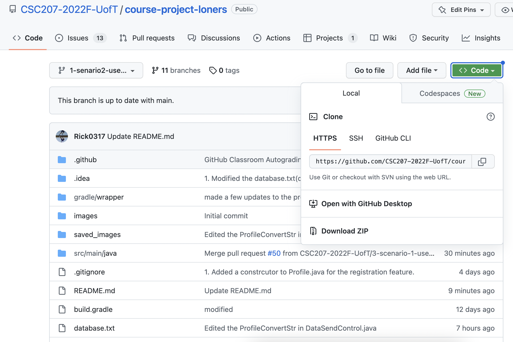
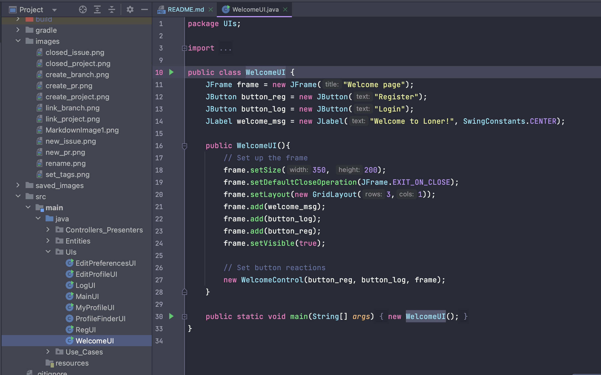

# Guide to use our Dating app
## 1, download all the files in this repository 
Click the green "Code" button on the top of this page.  
Then, click "Download Zip." All the files and directories will be downloaded as a zip file.  
  
Open the zip file in your desired local directory and open the file in IntelliJ Editor. 

## 2, You can run WelcomeUI.main()
In your IntelliJ Editor, run WelcomeUI.main() (src/main/java/UIs/WelcomeUI).  
  
A Java GUI will pop up and you can see the instruction that lets you choose between registration or login.   
By clicking either of these button, you will be redirected to RegistrationUI and LoginUI respectively.  
Then, you can see how user can register their info or login to their existing account.  
At this moment(Nov 21 8pm), the transition from one UI to another UI with the user information preserved is not implemented yet.  
Thus, you do not expect to see your input in either of your RegUI or LogUI affect your profile that will be displayed in MyProfileUI.  

## 3, You can run MainUI.main()
Now, you can run MainUI.main().  
This UI helps users to transit to MyProfileUI, PreferenceEditingUI, and ProfileFinderUI.    
You will see three buttons that redirect users to each of these UIs.  
In PreferenceEditingUI, you can edit your preferences.  The data in database.txt will be updated.  

## 4, MyProfileUI and EditProfileUI
After you are redirected to MyProfileUI, you will see your personal information displayed including your profile image.  
There is a button that will redirect you to EditProfileUI.  
In EditProfileUI, you will be able to edit your profile. At this moment(Nov 21 8pm), the UI includes preferences but this section will be deleted later on.  
Here, you have to upload one "jpg" image to be saved to successfully update your profile. 
 
FOR GRADING:
Download project and run the main method of the WelcomeUI class.
