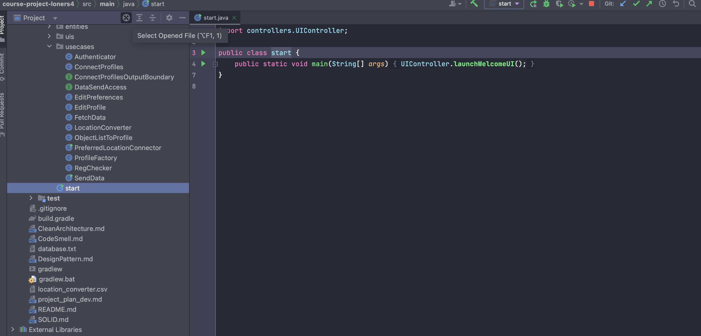
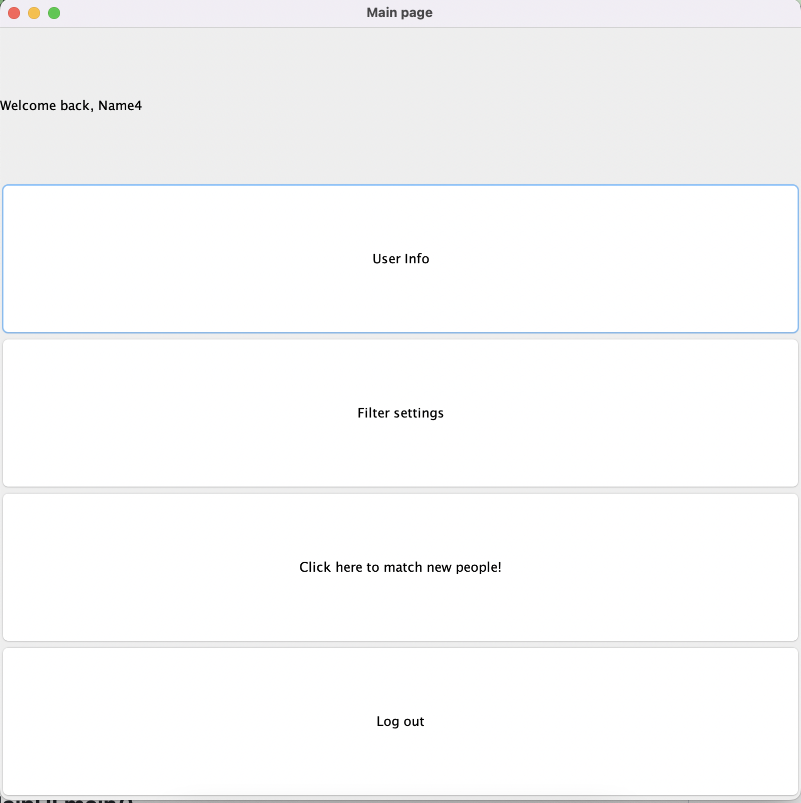

# Our project (Group53)
## For TAs, you can ignore commits after the deadline. We just fixed an error Occured to our repo
## Members
* Amelia Riddell
* Ethelia Choi
* Jamie Yuan
* Kelly Fan
* Rick Huang
* Siyoun Kim
## Changes after MileStone4
* We made test cases. 
* We began to use github feature more e.g. Issues, branches
* We checked all the possible code smells.  
* We used design patterns such as Singleton, Facade.   
* We followed clean architecture. For example, using Data access interfaces instead of using controllers to interact with the database.  
* We fixed all the bugs that stopped users from playing with our dating app.   
* We introduced some java interfaces for classes that can be abstracted.  
* We added markdown files.  
* We added UIcontroller that manages all the UI transitions    
* We communicated more. Each of us contributed to the project in terms of discussion. We met every week. Everyone is responsive to messages in discord.
Data does not show these processes but we are grateful we could work on this as a team. Wonderful team!  
## Markdown files where you can view how we follow SOLID, Clean Architecture, Design Pattern, and Code Smells.
[SOLID](https://github.com/CSC207-2022F-UofT/course-project-loners/blob/main/SOLID.md).  
[Clean Architecture](https://github.com/CSC207-2022F-UofT/course-project-loners/blob/main/CleanArchitecture.md).  
[Design Pattern](https://github.com/CSC207-2022F-UofT/course-project-loners/blob/main/DesignPattern.md).  
[Code Smell](https://github.com/CSC207-2022F-UofT/course-project-loners/blob/main/CodeSmell.md).  
## Test coverage
### Many of our classes involve UIs which are hard to test with unit test
   

[All the data can be found here](https://github.com/CSC207-2022F-UofT/course-project-loners/tree/main/CoverageReport). 

# Guide to use our Dating app
## 1, download all the files in this repository 
Click the green "Code" button on the top of this page.  
Then, click "Download Zip." All the files and directories will be downloaded as a zip file.  
  
Open the zip file in your desired local directory and open the file in IntelliJ Editor. 

## 2, start our application by running start.main()
In your IntelliJ Editor, run start.main() (src/main/java/start).  
  
A welcome page (WelcomeUI) will pop up and you can see the instruction that lets you choose between registration or login.  
  
By clicking either of these button, you will be redirected to registration page(RegistrationUI) and login page(LoginUI) respectively.  

  
Login page will show automaticlly after user finished registration.
Main page will show automaticlly after user login successfully.

## 3, Main page (mainUI)
After login, a main page will show to the user.  
  
This UI helps users to transit to other different UI.
* By clicking the "User Info" button, user will be brought to the MyProfileUI for viewing their personal profile.
* By clicking the "Filter settings" button, user will be brought to PreferenceEditingUI for editing their preference(filter), our matching algorithm will base on this setting to show user who only meet this setting.
* By clicking the "...match new people!" button, user will be brought to ProfileFinderUI for matching with other users. Note that user has to set up their preference at least once before they use this feature. A re-login user who has set it before will not be affected.
* By clicking the "Log out" button, system will log out the user and bring them back to the welcome page.    

Below sessions are some introductions for the MyProfileUI, PreferenceEditingUI and ProfileFinderUI.

## 4, MyProfileUI and EditProfileUI
After you are redirected to MyProfileUI, you will see your personal information displayed including your profile image and preference settings. By clicking the "Edit this profile" button, it will redirect you to EditProfileUI.  
   
In EditProfileUI, you will be able to edit your profile.  
Here, you have to upload one "jpg" image to be saved to successfully update your profile.  

## 5, PreferenceEditingUI
In PreferenceEditingUI, you can edit your preferences. The data in database.txt will be updated by clicking "Change Preferences" button.    
As mentioning before, the references will be used on "filtering" other users when you use the matching feature.  

## 6, ProfileFinderUI
In ProfileFinderUI, you can see users that 

<a href="#">Back to top</a>
