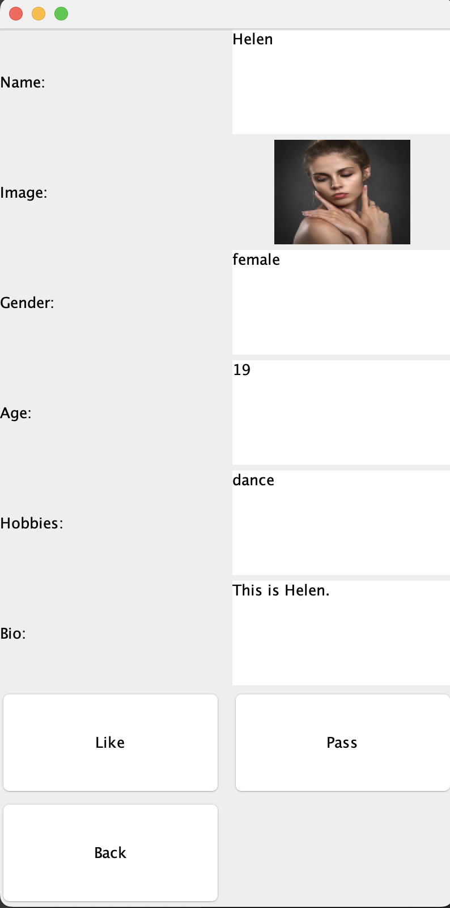

# Our project (Group53)
## Members
* Amelia Riddell
* Ethelia Choi
* Jamie Yuan
* Kelly Fan
* Rick Huang
* Siyoun Kim
## Changes after MileStone4
* We made test cases. 
* We began to use github feature more e.g. Issues, branches
* We checked all the possible code smells.  
* We used design patterns such as Singleton, Facade.   
* We followed clean architecture. For example, using Data access interfaces instead of using controllers to interact with the database.  
* We fixed all the bugs that stopped users from playing with our dating app.   
* We introduced some java interfaces for classes that can be abstracted.  
* We added markdown files.  
* We added UIcontroller that manages all the UI transitions    
* We communicated more. Each of us contributed to the project in terms of discussion. We met every week. Everyone is responsive to messages in discord.
Data does not show these processes but we are grateful we could work on this as a team. Wonderful team!  
## Markdown files where you can view how we follow SOLID, Clean Architecture, Design Pattern, and Code Smells.
[SOLID](https://github.com/CSC207-2022F-UofT/course-project-loners/blob/main/SOLID.md).  
[Clean Architecture](https://github.com/CSC207-2022F-UofT/course-project-loners/blob/main/CleanArchitecture.md).  
[Design Pattern](https://github.com/CSC207-2022F-UofT/course-project-loners/blob/main/DesignPattern.md).  
[Code Smell](https://github.com/CSC207-2022F-UofT/course-project-loners/blob/main/CodeSmell.md).  
## Test coverage
### Many of our classes involve UIs which are hard to test with unit test
   

[All the data can be found here](https://github.com/CSC207-2022F-UofT/course-project-loners/tree/main/CoverageReport). 

# Guide to use our Dating app
## 1, download all the files in this repository 
Click the green "Code" button on the top of this page.  
Then, click "Download Zip." All the files and directories will be downloaded as a zip file.  
  
Open the zip file in your desired local directory and open the file in IntelliJ Editor. 

## 2, You can run WelcomeUI.main()
In your IntelliJ Editor, run WelcomeUI.main() (src/main/java/uis/WelcomeUI).  
  
A Java GUI will pop up and you can see the instruction that lets you choose between registration or login.  
  
By clicking either of these button, you will be redirected to RegistrationUI and LoginUI respectively.  

  
Then, you can see how user can register their info or login to their existing account.  
At this moment(Nov 21 8pm), the transition from one UI to another UI with the user information preserved is not implemented yet.  
Thus, you do not expect to see your input in either of your RegUI or LogUI affect your profile that will be displayed in MyProfileUI.  

## 3, You can run MainUI.main()
Now, you can run MainUI.main() (src/main/java/uis/MainUI).  
  
This UI helps users to transit to MyProfileUI, PreferenceEditingUI, and ProfileFinderUI.    
You will see three buttons that redirect users to each of these uis.  
In PreferenceEditingUI, you can edit your preferences.  The data in database.txt will be updated.  

## 4, MyProfileUI and EditProfileUI
After you are redirected to MyProfileUI, you will see your personal information displayed including your profile image.  
There is a button that will redirect you to EditProfileUI.  
. 
In EditProfileUI, you will be able to edit your profile. At this moment(Nov 21 8pm), the UI includes preferences but this section will be deleted later on.  
Here, you have to upload one "jpg" image to be saved to successfully update your profile.  

<a href="#top">Back to top</a>
